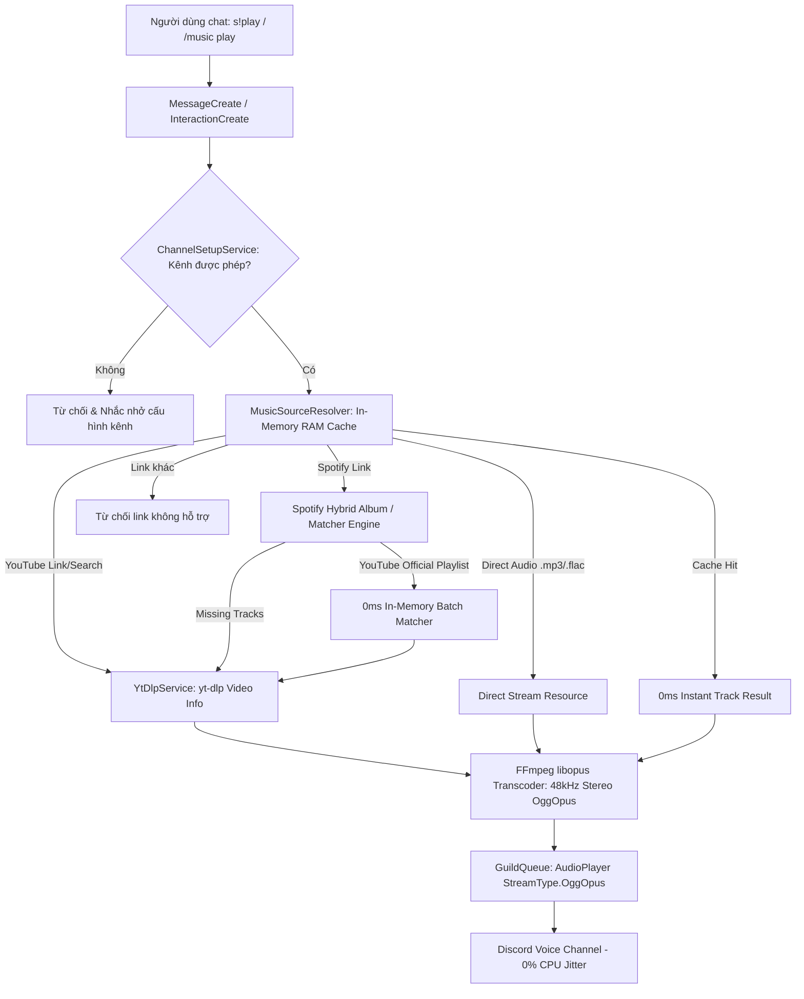

# 🏛️ Kiến Trúc Hệ Thống & Hướng Dẫn Mở Rộng (SOLID & Clean Code)

Tài liệu này giải thích chi tiết cách dự án áp dụng các nguyên lý thiết kế phần mềm **SOLID** và cách mở rộng các module (Sự kiện, Kiểm duyệt ngôn từ AI, Slash Command, Service) một cách chuẩn mực.

---

## 1. Ứng dụng các nguyên lý SOLID trong dự án

### 🔹 S - Single Responsibility Principle (Đơn trách nhiệm)
Mỗi module/class chỉ chịu trách nhiệm cho một tác vụ duy nhất:
- `src/config/env.js`: Nạp, chuẩn hóa và kiểm tra biến môi trường.
- `src/config/moderation.js`: Cấu hình ngưỡng điểm cảnh cáo, thời gian phạt timeout, quyền miễn trừ kiểm duyệt.
- `src/utils/logger.js`: In log chuẩn hóa ra console và ghi log xoay vòng file tự động.
- `src/utils/embedBuilder.js`: Xây dựng các mẫu giao diện Embed Card (Welcome, Leave, Warning Moderation).
- `src/services/memberNotificationService.js`: Xử lý nghiệp vụ thông báo thành viên ra vào.
- `src/services/toxicity/IToxicityDetector.js`: Hợp đồng trừu tượng cho việc phân loại độc hại.
- `src/services/toxicity/RuleBasedDetector.js`: Phân loại ngôn từ tiếng Việt nhanh (CLEAN / OFFENSIVE / HATE) bằng biểu thức chính quy & chuẩn hóa teencode.
- `src/services/toxicity/AIModelDetector.js`: Tích hợp mô hình AI (PhoBERT / ViHSD) qua Transformers.js / ONNX.
- `src/services/toxicity/HybridToxicityDetector.js`: Kết hợp rule-based và AI Model theo Strategy pattern.
- `src/services/warningStore.js`: Quản lý điểm phạt, lịch sử vi phạm và cơ chế tự động hết hạn điểm sau 24h.
- `src/services/moderationService.js`: Điều phối quy trình kiểm duyệt tin nhắn và thực thi hình phạt (Timeout, Kick, Ban).
- `src/core/EventLoader.js`: Tự động quét và đăng ký sự kiện Discord.
- `src/core/BotClient.js`: Quản lý vòng đời và kết nối Gateway của Bot.

### 🔹 O - Open/Closed Principle (Đóng - Mở)
- Hệ thống **mở rộng cho các tính năng mới** nhưng **đóng cho việc sửa đổi code cốt lõi**.
- Thêm sự kiện mới (`src/events/`): Chỉ cần tạo file kế thừa `BaseEvent`. `EventLoader` sẽ tự động phát hiện và nạp mà không cần sửa `BotClient.js`.
- Thêm engine phân loại ngôn ngữ mới: Chỉ cần tạo class kế thừa `IToxicityDetector` và cắm vào `ModerationService`.

### 🔹 L - Liskov Substitution Principle (Thay thế Liskov)
- Mọi Event Handler đều kế thừa từ `BaseEvent` (`execute(message, client)`).
- Mọi bộ phân loại (`RuleBasedDetector`, `AIModelDetector`, `HybridToxicityDetector`) đều kế thừa `IToxicityDetector` (`classify(text)`).

### 🔹 I - Interface Segregation Principle (Phân tách giao diện)
- Các sự kiện và dịch vụ chỉ nhận đúng dữ liệu và phụ thuộc mà chúng cần.

### 🔹 D - Dependency Inversion Principle (Đảo ngược phụ thuộc)
- `ModerationService` phụ thuộc vào abstraction `IToxicityDetector` và `WarningStore`, không phụ thuộc trực tiếp vào cài đặt cụ thể.

---

## 2. Hệ thống Lọc từ ngữ độc hại & Hate Speech 3 Nhãn (ViHSD Moderation)

```mermaid
flowchart TD
    A[Sự kiện MessageCreate] --> B[Kiểm tra: Bỏ qua Bot, Webhook & Admin]
    B --> C[ModerationService]
    C --> D[HybridToxicityDetector]
    D --> E{Phân tích kết quả}
    
    E -->|CLEAN| F[Hợp lệ - Cho qua]
    E -->|OFFENSIVE (+1)| G[Xóa tin nhắn & Tăng điểm Cảnh cáo]
    E -->|HATE (+2)| G
    
    G --> H[WarningStore: Quản lý điểm tích lũy]
    H --> I{Kiểm tra Ngưỡng phạt}
    
    I -->|1 - 2 cảnh cáo| J[Gửi Embed cảnh cáo vi phạm]
    I -->|>= 3 cảnh cáo| K[Cảnh cáo + Timeout 10 phút]
    I -->|>= 5 cảnh cáo| L[Kick khỏi Server]
    I -->|>= 7 cảnh cáo| M[Ban vĩnh viễn khỏi Server]
```

---

## 3. Hệ thống Logging & Log Rotation (Tự động dọn dẹp)

Dự án sử dụng module `src/utils/logger.js` được thiết kế tối ưu, không phụ thuộc thư viện nặng ngoài (Zero-dependency):
- **Phân luồng Log chuẩn hệ thống**:
  - `logs/app.log`: Toàn bộ nhật ký hoạt động (INFO, WARN, ERROR, SUCCESS), tối ưu cho lệnh `tail -f logs/app.log`.
  - `logs/error.log`: Chỉ lưu các lỗi kèm Stack trace chi tiết để tiện debug.
  - `logs/daily/app-YYYY-MM-DD.log` & `logs/daily/error-YYYY-MM-DD.log`: Lưu trữ lịch sử theo từng ngày.
- **Cơ chế xoá Log cũ tự động (Retention Policy: 60 ngày)**:
  - Tự động chạy khi khởi động và định kỳ mỗi 24 giờ một lần.
  - Tự động quét và xóa sạch các file log cũ hơn 60 ngày nhằm bảo vệ dung lượng lưu trữ của máy chủ/hosting.

---

## 4. Hệ thống Phát Nhạc (Music Architecture) & Channel Setup



### Thành phần chính của Music Module:
- `src/music/Track.js`: Đại diện cho bài hát, chuẩn hóa thời lượng và nạp Audio Resource qua `StreamType.OggOpus`.
- `src/music/MusicSourceResolver.js`: Nhận diện URL, phân giải Spotify thành Album/Track chính chủ trên YouTube, tích hợp bộ đệm RAM Cache 1000 bài (TTL 2h, ~1MB).
- `src/music/YtDlpService.js`: Điều phối tiến trình `yt-dlp` và `ffmpeg-static` để stream trực tiếp native OggOpus, bắt lỗi EPIPE và giải phóng stream sạch sẽ.
- `src/music/GuildQueue.js`: Quản lý AudioPlayer, hàng đợi bài hát, chế độ lặp (track/queue/off), volume logarithmic và timeout tự rời kênh khi idle (3 phút).
- `src/music/MusicManager.js`: Singleton quản lý toàn bộ `GuildQueue` cho các máy chủ.
- `src/events/guild/voiceStateUpdate.js`: Giám sát trạng thái kênh thoại (báo động ngắt kết nối đột ngột, chuyển kênh và phòng trống).
- `src/services/channelSetupService.js`: Lưu trữ và kiểm tra phân quyền kênh văn bản được phép dùng lệnh.
- `src/services/musicCommandHandler.js`: Điều phối và phản hồi toàn bộ lệnh prefix `s!`.
- `src/services/musicButtonHandler.js`: Điều phối và phản hồi toàn bộ tương tác nút bấm Player (Play/Pause, Skip, Stop, Loop, Volume, Queue) và phân trang hàng đợi.

