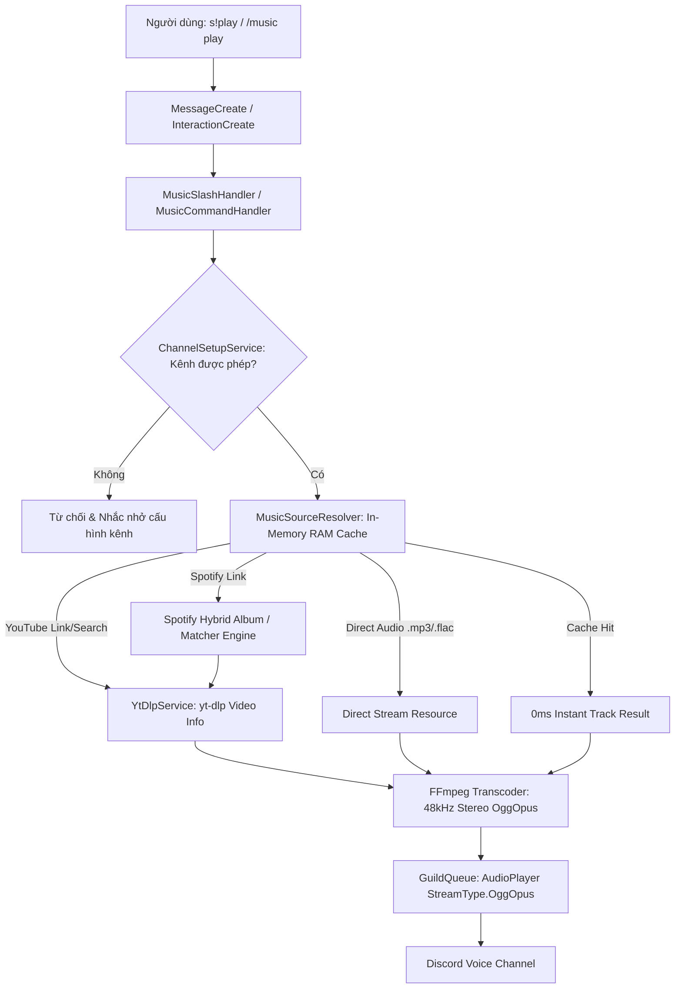

# 🏛️ Kiến Trúc Hệ Thống & Hướng Dẫn Mở Rộng (DDD, SOLID & Clean Code)

Tài liệu này giải thích chi tiết cấu trúc hệ thống theo **Domain-Driven Design (DDD)**, các nguyên lý **SOLID**, cơ chế **Prompt Markdown Template**, và cách vận hành mở rộng các module trong Bot.

---

## 1. Cấu Trúc Thư Mục Theo Domain-Driven Design (DDD)

Codebase được tổ chức theo từng Domain chức năng độc lập, loại bỏ các file cồng kềnh ("ngàn dòng"):

```
src/
├── core/                                      # Core Bot Client & Event Loader
│   ├── BotClient.js                           # Vòng đời kết nối Gateway Discord
│   └── EventLoader.js                         # Quét và đăng ký tự động các sự kiện
│
├── config/                                    # Cấu hình hệ thống
│   ├── env.js                                 # Validate & nạp biến môi trường
│   └── moderation.js                          # Cấu hình ngưỡng cảnh cáo & hình phạt
│
├── utils/                                     # Utility helpers dùng chung
│   ├── logger.js                              # Logger xoay vòng file & retention 60 ngày
│   ├── embedBuilder.js                        # Facade điều phối tạo Embed Card Discord
│   └── embeds/                                # Các modules xây dựng Embed theo Domain
│       ├── colors.js                          # Bảng màu chuẩn thống nhất
│       ├── notificationEmbeds.js              # Embeds Chào mừng / Tạm biệt (Welcome & Leave)
│       ├── moderationEmbeds.js                # Embeds Cảnh báo ngôn từ & Whitelist
│       ├── settingsEmbeds.js                  # Embeds Cấu hình Server (Feature, AI, Knowledge, Channel, Notify)
│       ├── helpEmbeds.js                      # Embeds Bảng hướng dẫn sử dụng (Help)
│       ├── musicEmbeds.js                     # Embeds & Button Rows Player / Queue
│       └── aiEmbeds.js                        # Embeds Trạng thái & Phản hồi AI Assistant
│
├── commands/                                  # Slash Command Orchestration & Registration
│   ├── slashCommands.js                       # Điểm điều phối đăng ký Slash Commands toàn cầu
│   └── builders/                              # Tách riêng từng Builder theo Single Responsibility
│       ├── setupCommandBuilder.js             # Builder Facade cho /setup
│       ├── setup/                             # Subcommand Groups cấu hình tách nhỏ
│       │   ├── channelGroup.js                # /setup channel
│       │   ├── whitelistGroup.js              # /setup whitelist
│       │   ├── featureGroup.js                # /setup feature
│       │   ├── notifyGroup.js                 # /setup notify
│       │   ├── aiGroup.js                     # /setup ai
│       │   └── knowledgeGroup.js              # /setup knowledge
│       ├── musicCommandBuilder.js             # Builder cho /music
│       ├── helpCommandBuilder.js              # Builder cho /help
│       └── askCommandBuilder.js               # Builder cho /ask
│
├── events/                                    # Discord Event Listeners (Event-Driven)
│   ├── BaseEvent.js                           # Lớp sự kiện cơ sở
│   ├── client/
│   │   └── ready.js                           # Sự kiện Bot sẵn sàng
│   └── guild/
│       ├── interactionCreate.js               # Event Router tinh gọn (~90 dòng)
│       ├── messageCreate.js                   # Message Router điều phối các domain
│       ├── guildCreate.js                     # Chào mừng khi bot vào server mới
│       ├── guildMemberAdd.js                  # Thông báo thành viên mới vào
│       ├── guildMemberRemove.js               # Thông báo thành viên rời đi
│       └── voiceStateUpdate.js                # Giám sát trạng thái phòng voice
│
└── services/                                  # Business Logic theo Feature / Domain (DDD)
    ├── ai/                                    # 🤖 AI Assistant Domain
    │   ├── skills/                            # 📄 Prompt Templates dạng Markdown (.md)
    │   │   ├── systemPrompt.md                # System prompt chuẩn mực (chống trích nguồn thô)
    │   │   └── searchRagPrompt.md             # Format dữ liệu tìm kiếm Internet Grounding
    │   ├── aiService.js                       # Điều phối AI, Rate-limit, Fallback
    │   ├── askCommandHandler.js               # Handler cho lệnh !ask và /ask
    │   ├── geminiService.js                   # Client Google Gemini
    │   ├── openrouterService.js               # Client OpenRouter (Fallback)
    │   ├── promptService.js                   # Nạp prompt .md từ skills/ & bind context
    │   ├── tavilySearchService.js             # Tavily AI Search RAG (lọc sạch citation thô)
    │   ├── serverContextService.js            # Trích xuất ngữ cảnh server theo thời gian thực
    │   ├── serverKnowledgeService.js          # Nguồn dữ liệu tri thức nội bộ Server
    │   └── memoryService.js                   # Bộ nhớ hội thoại ngắn hạn (TTL 15 phút)
    │
    ├── music/                                 # 🎵 Music Domain
    │   ├── GuildQueue.js                      # Quản lý AudioPlayer và hàng đợi bài hát
    │   ├── MusicManager.js                    # Singleton quản lý Queue các server
    │   ├── MusicSourceResolver.js             # Phân giải YouTube, Spotify (RAM Cache 1000 bài)
    │   ├── Track.js                           # Model đại diện bài hát
    │   ├── YtDlpService.js                    # yt-dlp & FFmpeg OggOpus transcoder
    │   ├── musicCommandHandler.js             # Handler cho prefix s!play, s!skip...
    │   ├── musicButtonHandler.js              # Handler cho nút bấm Player & phân trang
    │   └── musicSlashHandler.js               # Handler cho Slash Command /music
    │
    ├── moderation/                            # 🛡️ Moderation Domain
    │   ├── moderationService.js               # Điều phối quy trình lọc từ & xử phạt
    │   ├── warningStore.js                    # Lưu trữ điểm phạt vi phạm (hết hạn sau 24h)
    │   ├── whitelistService.js                # Quản lý danh sách trắng User, Role, Kênh
    │   ├── whitelistCommandHandler.js         # Handler cho prefix !setup whitelist
    │   └── toxicity/                          # Strategy Pattern phân loại độc hại
    │       ├── IToxicityDetector.js           # Abstract Interface
    │       ├── RuleBasedDetector.js           # Regex & chuẩn hóa tiếng Việt/teencode
    │       ├── AIModelDetector.js             # AI PhoBERT / ViHSD Classifier
    │       └── HybridToxicityDetector.js      # Kết hợp Rule & AI
    │
    ├── settings/                              # ⚙️ Guild Configuration Domain
    │   ├── guildSettingsService.js            # Lưu trữ cấu hình multi-guild vào JSON
    │   ├── channelSetupService.js             # Quản lý phân quyền kênh lệnh bot
    │   ├── featureCommandHandler.js           # Handler bật/tắt tính năng server
    │   ├── setupCommandHandler.js             # Facade router tinh gọn cho !setup
    │   ├── setupSlashHandler.js               # Handler cho Slash Command /setup & autocomplete
    │   └── handlers/                          # Sub-handlers chuyên biệt
    │       ├── aiSetupHandler.js              # !setup ai, !setup model, !setup primary
    │       ├── channelSetupHandler.js         # !setup channel add/remove/list/clear
    │       ├── featureSetupHandler.js         # !setup feature enable/disable/status
    │       ├── knowledgeSetupHandler.js       # !setup knowledge channel/text/msg...
    │       ├── notifySetupHandler.js          # !setup notify welcome/leave...
    │       └── whitelistSetupHandler.js       # !setup whitelist add/remove...
    │
    ├── notifications/                         # 🔔 Notifications Domain
    │   └── memberNotificationService.js       # Xử lý thiệp chào mừng & thông báo rời đi
    │
    └── help/                                  # ❓ Help Domain
        └── helpCommandHandler.js              # Xử lý !help và /help
```

---

## 2. Ứng Dụng Các Nguyên Lý SOLID Trong Dự Án

### 🔹 S - Single Responsibility Principle (Đơn trách nhiệm)
- Mỗi class/module chỉ đảm nhận một lý do duy nhất để thay đổi.
- **Trước refactor:** `setupCommandHandler.js` chứa hơn 900 dòng gộp cả kênh, thông báo, AI, tri thức, whitelist; `interactionCreate.js` chứa hơn 1500 dòng ôm toàn bộ Slash Commands.
- **Sau refactor:** `setupCommandHandler.js` và `interactionCreate.js` chuyển thành các Facade/Router siêu gọn (~90 dòng), phân chia nhiệm vụ cho các sub-handlers trong từng domain.

### 🔹 O - Open/Closed Principle (Đóng - Mở)
- Hệ thống **mở cho việc mở rộng** nhưng **đóng cho việc sửa đổi code cốt lõi**.
- Thêm Slash Command mới: Chỉ cần thêm builder trong `src/commands/builders/` và cắm handler tương ứng vào `interactionCreate.js`.
- Thêm bộ phân loại độc hại mới: Tạo class kế thừa `IToxicityDetector` và tích hợp vào `HybridToxicityDetector`.

### 🔹 L - Liskov Substitution Principle (Thay thế Liskov)
- Mọi Event Handler đều kế thừa từ `BaseEvent` (`execute(...)`).
- Mọi bộ phân loại độc hại (`RuleBasedDetector`, `AIModelDetector`) đều tuân thủ interface chuẩn từ `IToxicityDetector` (`classify(text)`).

### 🔹 I - Interface Segregation Principle (Phân tách giao diện)
- Các sub-handlers (như `aiSetupHandler`, `notifySetupHandler`, `knowledgeSetupHandler`) chỉ nhận đúng các tham số và nghiệp vụ cần thiết, không bị phụ thuộc vào các module khác.

### 🔹 D - Dependency Inversion Principle (Đảo ngược phụ thuộc)
- Các tầng Controller/Event không phụ thuộc trực tiếp vào cài đặt thấp cấp mà giao tiếp thông qua các Domain Services và Abstractions.

---

## 3. Hệ Thống AI Prompts (Markdown Skills & Chống Trích Nguồn Thô)

### 📄 Quản lý Prompts bằng Markdown (.md)
Thay vì hardcode chuỗi prompt dài dòng trong code JavaScript, toàn bộ prompts được lưu trữ dạng file Markdown chuẩn tại `src/services/ai/skills/`:
- **`systemPrompt.md`**: Định nghĩa vai trò của AI, nguyên tắc Fact vs Opinion, chống ảo giác (Anti-hallucination) và định dạng hiển thị Discord (không dùng bảng Markdown, dùng bullet list). Hỗ trợ dynamic placeholders như `{{serverName}}`.
- **`searchRagPrompt.md`**: Template chuẩn hóa dữ liệu tìm kiếm Internet Grounding.

### 🛡️ Cơ chế chống trích nguồn thô từ Tavily Search RAG
Khi sử dụng Tavily AI Search, kết quả đôi khi bị chèn các chỉ số trích dẫn thô như `(nguồn 3, 4)` hoặc `[1]`. Hệ thống xử lý triệt để qua 2 lớp bảo vệ:
1. **Lớp Prompting (`systemPrompt.md`):** Quy định nghiêm ngặt cấm xuất ra các nhãn trích dẫn thô dạng `(nguồn X)`, yêu cầu AI tổng hợp và diễn đạt liền mạch, tự nhiên như kiến thức thông thái của chính AI.
2. **Lớp Sanitization (`tavilySearchService.js`):** Hàm `cleanCitations()` tự động lọc sạch toàn bộ regex `(nguồn \d+)`, `[\d+]` trước khi ghép vào ngữ cảnh gửi tới LLM.

---

## 4. Hệ Thống Phát Nhạc (Music Architecture)



---

## 5. Hệ Thống Cấu Hình Server (Multi-Guild Configuration)

Toàn bộ cấu hình của từng Server được lưu trữ tập trung tại `data/guild_settings.json`:
- **Features State**: Bật/tắt các tính năng `moderation`, `welcome`, `leave`, `ai`, `music`.
- **Notification Channels**: Cài đặt kênh Chào mừng (`welcomeChannelId`) và Tạm biệt (`leaveChannelId`).
- **Allowed Channels**: Danh sách kênh được cấp phép dùng bot & nhạc.
- **AI Settings**: Provider chính (`primaryProvider`), model tùy chỉnh (`geminiModel`, `openrouterModel`).
- **Dynamic Knowledge**: Danh sách kênh tri thức (`channelIds`), tin nhắn chỉ định (`messages`), văn bản tùy chỉnh (`customTexts`).
- **Whitelist**: Danh sách trắng miễn trừ kiểm duyệt cho User, Role, Channel.
