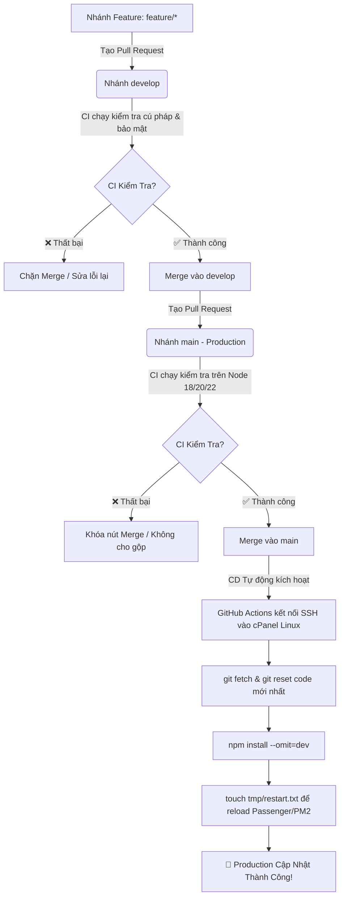

# 🔄 Hướng Dẫn Thiết Lập Quy Trình CI/CD Tự Động Triển Khai Lên cPanel Linux

Tài liệu này mô tả chi tiết quy trình phát triển phần mềm chuẩn GitFlow, cách thức hoạt động của hệ thống CI/CD (GitHub Actions) và hướng dẫn cấu hình Secrets để tự động kéo code, cài đặt và khởi động lại Bot trên cPanel mỗi khi gộp code vào `main`.

---

## 🗺️ 1. Sơ đồ luồng làm việc (GitFlow & CI/CD Workflow)



---

## 🔐 2. Cấu hình GitHub Secrets (Bắt buộc cho CD Deploy)

Để GitHub Actions có thể tự động kết nối SSH và kéo code về cPanel, bạn cần thêm các thông số kết nối vào GitHub Repository:

1. Truy cập vào Repository của bạn trên GitHub.
2. Vào tab **Settings** -> Mục **Secrets and variables** (ở menu bên trái) -> Chọn **Actions**.
3. Nhấn vào nút **New repository secret** và thêm lần lượt các Secret sau:

| Tên Secret | Ý nghĩa & Giá trị | Ví dụ |
| :--- | :--- | :--- |
| `CPANEL_SSH_HOST` | Địa chỉ IP máy chủ hoặc Domain của hosting | `gienphim.site` hoặc `123.45.67.89` |
| `CPANEL_SSH_USER` | Tên đăng nhập cPanel của bạn | `your_cpanel_username` |
| `CPANEL_SSH_PASSWORD` | Mật khẩu tài khoản cPanel / SSH | `MatKhauCuaBan123@` |
| `CPANEL_SSH_PORT` | Cổng kết nối SSH của hosting *(mặc định 22)* | `22` (hoặc cổng riêng do hosting cung cấp) |
| `CPANEL_APP_PATH` | Đường dẫn thư mục chứa bot trên hosting | `/home/username/hoangnek_bot_discord` |

> [!TIP]
> Nếu hosting cPanel của bạn dùng **SSH Key** thay vì Password, bạn có thể tạo secret `CPANEL_SSH_KEY` và dán Private Key vào đó.

---

## 🛡️ 3. Thiết lập Branch Protection Rules (Bắt buộc CI Pass mới cho Merge)

Để đảm bảo quy tắc **"CI Fail -> Không được merge, CI Pass -> Mới được merge"**, bạn cài đặt trên GitHub như sau:

1. Trên GitHub Repo, vào **Settings** -> **Branches**.
2. Nhấn nút **Add branch ruleset** (hoặc **Add rule**).
3. **Branch name pattern**: Điền `main` (làm tương tự thêm 1 rule cho `develop`).
4. Tích chọn các mục bảo vệ:
   - ✅ **Require a pull request before merging** (Bắt buộc tạo PR, không cho push thẳng vào `main`).
   - ✅ **Require status checks to pass before merging** (Bắt buộc CI phải Pass).
   - Trong ô tìm kiếm kiểm tra (Status checks), tìm và chọn: `Syntax & Quality Test (Node 20.x)` (hoặc các job test của workflow CI).
5. Nhấn **Save changes** (Lưu thay đổi).

---

## 🚀 4. Trải nghiệm quy trình thực tế

### Bước 1: Phát triển tính năng mới trên nhánh feature
```bash
git checkout develop
git checkout -b feature/ten-tinh-nang-moi
# Viết code và commit
git push -u origin feature/ten-tinh-nang-moi
```

### Bước 2: Tạo Pull Request vào `develop`
- Lên GitHub tạo PR từ `feature/ten-tinh-nang-moi` vào `develop`.
- GitHub Actions CI sẽ tự động chạy kiểm tra.
- Nếu có lỗi cú pháp hoặc lộ file `.env`, CI báo đỏ ❌ và nút Merge bị khóa.
- Khi CI báo xanh ✅, bạn nhấn **Merge pull request**.

### Bước 3: Đưa lên Production (`main`)
- Tạo PR từ `develop` vào `main`.
- CI tiếp tục kiểm tra chất lượng code trên `main`.
- Sau khi bấm **Merge**:
  - Workflow `cd-production.yml` sẽ tự động kích hoạt.
  - SSH vào cPanel -> Kéo code mới nhất -> Cài đặt thư viện -> Khởi động lại bot.
  - Toàn bộ quá trình diễn ra tự động trong vòng **10 - 20 giây**!
