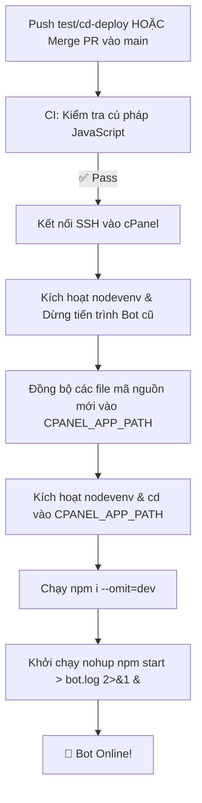

# 🔄 Hướng Dẫn Thiết Lập CI/CD Tự Động Qua SSH cPanel

Tài liệu này hướng dẫn chi tiết cách cấu hình **GitHub Actions (CI/CD)** để tự động kiểm tra code và deploy lên hosting cPanel thông qua giao thức SSH với môi trường Node.js Selector (`nodevenv`).

---

## 🗺️ 1. Cơ chế kích hoạt (Trigger Rules)

- **Nhánh `test/cd-deploy`**: Khi `git push` trực tiếp lên nhánh `test/cd-deploy`, GitHub Actions sẽ chạy CI kiểm tra lỗi và **tự động deploy để test**.
- **Nhánh `main`**: **Không kích hoạt khi push trực tiếp**. Chỉ kích hoạt CD khi **Gộp (Merge Pull Request)** từ nhánh khác vào `main`.
- **Thủ công**: Có thể bấm **Run workflow** trên GitHub Actions khi cần.

---

## 🔑 2. Cấu hình GitHub Secrets (Khớp chính xác với cPanel)

Truy cập: **GitHub Repository** ➔ **Settings** ➔ **Secrets and variables** ➔ **Actions** ➔ **New repository secret**:

| Tên Secret | Ý nghĩa / Giá trị mẫu |
| :--- | :--- |
| `CPANEL_SSH_HOST` | IP máy chủ hoặc tên miền cPanel (VD: `103.xxx.xxx.xxx` hoặc `server.yourdomain.com`) |
| `CPANEL_SSH_USER` | Tên tài khoản cPanel (VD: `mtopmqqm`) |
| `CPANEL_SSH_PASSWORD` | Mật khẩu tài khoản cPanel / SSH |
| `CPANEL_SSH_PORT` | Cổng SSH (thường là `22` hoặc cổng riêng do nhà cung cấp hosting cấp) |
| `CPANEL_APP_PATH` | Đường dẫn thư mục mã nguồn bot trên cPanel: `/home/mtopmqqm/bot/hoangnek_bot_discord` |

---

## ⚙️ 3. Quy trình tự động thực thi

- **Môi trường ảo Node.js**: Tự động nhận diện và `source /home/mtopmqqm/nodevenv/bot/hoangnek_bot_discord/18/bin/activate` để sử dụng đúng phiên bản Node/NPM của cPanel.
- **Bảo mật `.env`**: Pipeline bỏ qua file `.env`, không ghi đè cấu hình token trên máy chủ.
