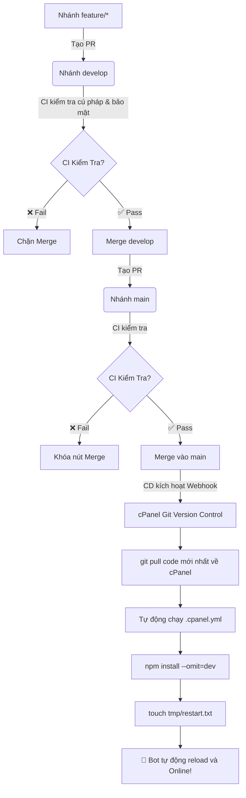

# 🔄 Hướng Dẫn Thiết Lập CI/CD Qua cPanel Git™ Version Control

Tài liệu này hướng dẫn chi tiết cách kết hợp **GitHub Actions (CI)** và **cPanel Git™ Version Control (CD)** để tự động kiểm tra code, tự động kéo code về hosting, tự động cài thư viện `npm install` và tự động khởi động lại bot.

---

## 🗺️ 1. Sơ đồ luồng làm việc tự động (CI/CD)



---

## 🛠️ 2. Hướng dẫn thiết lập trên cPanel (Từng bước chi tiết)

### 🟢 Bước 1: Clone Repository vào cPanel
1. Đăng nhập vào cPanel của bạn.
2. Tìm mục **Files (Tệp)** -> Chọn **Git™ Version Control**.
3. Nhấn nút **Create** (Tạo kho lưu trữ):
   - **Clone a repository**: Bật công tắc này sang **ON**.
   - **Clone URL**: Dán link GitHub của bạn:  
     `https://github.com/hoangbmt023/hoangnek_bot_discord.git`  
     *(Nếu repo Private, dùng dạng: `https://<GITHUB_TOKEN>@github.com/hoangbmt023/hoangnek_bot_discord.git`)*.
   - **Repository Path**: Điền tên thư mục: `hoangnek_bot_discord`
   - **Repository Name**: Điền: `hoangnek_bot_discord`
4. Nhấn **Create** -> cPanel sẽ tải toàn bộ mã nguồn về.

---

### 🟢 Bước 2: Lấy Webhook URL từ cPanel
1. Trong danh sách repositories của **Git™ Version Control**, nhấn nút **Manage** bên cạnh `hoangnek_bot_discord`.
2. Chuyển sang tab **Pull or Deploy** (hoặc tab **Webhook** tùy giao diện cPanel).
3. Tìm mục **Webhook** -> **Copy đường dẫn Webhook URL** do cPanel cung cấp.  
   *(Đường dẫn thường có dạng: `https://cpanel.domain.com:2083/cpanelapp/git/deploy.live.cgi?repo=hoangnek_bot_discord...`)*.

---

### 🟢 Bước 3: Dán Webhook URL vào GitHub Secrets
1. Mở GitHub Repository của bạn trên trình duyệt.
2. Vào **Settings** -> **Secrets and variables** -> **Actions**.
3. Nhấn **New repository secret**:
   - **Name**: `CPANEL_DEPLOY_WEBHOOK_URL`
   - **Secret**: Dán đường link Webhook URL vừa copy ở Bước 2.
4. Nhấn **Add secret**.

---

## ⚙️ 3. Cơ chế tự động chạy `.cpanel.yml`
Khi cPanel nhận được tín hiệu Webhook, nó sẽ tự động chạy file [.cpanel.yml](file:///c:/File_Hoc/NodeJs/hoangnek_bot_discord/.cpanel.yml):

```yaml
---
deployment:
  tasks:
    - export DEPLOYPATH=/home/$USER/hoangnek_bot_discord/
    - /bin/cp -R * $DEPLOYPATH
    - cd $DEPLOYPATH && npm install --omit=dev 2>/dev/null || true
    - cd $DEPLOYPATH && /bin/mkdir -p tmp && /bin/touch tmp/restart.txt
```

- **Bước 1**: Copy toàn bộ file code mới vào thư mục chạy ứng dụng.
- **Bước 2**: Tự động chạy `npm install` cập nhật các package mới.
- **Bước 3**: Tạo file `tmp/restart.txt` để Phusion Passenger trên cPanel reload lại Bot ngay lập tức.
- **File `.env`**: Được bảo vệ an toàn 100%, không bị ghi đè hay mất cấu hình.

---

## 🚀 4. Trải nghiệm:
Bây giờ mỗi khi bạn merge code vào `main` (hoặc push `test/cd-deploy`):
1. **GitHub Actions** sẽ chạy kiểm tra CI cú pháp và logic.
2. Sau khi Pass ✅, nó sẽ tự động ping Webhook sang cPanel.
3. cPanel tự động kéo code, tải thư viện và restart Bot trong vòng 10 giây!
