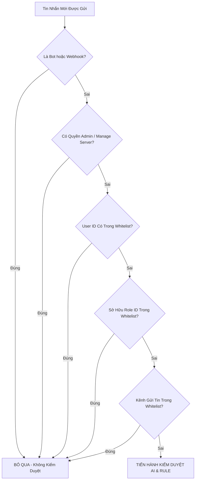

# 🔐 Hướng Dẫn Chi Tiết Về Phân Quyền & Quyền Truy Cập Lệnh (Permissions Guide)

Tài liệu này tổng hợp toàn bộ cơ chế phân quyền, kiểm soát truy cập (Access Control), điều kiện thực thi từng nhóm câu lệnh và danh sách quyền hạn cần cấp cho Bot trong dự án **Hoangnek Discord Bot**.

---

## 🧭 1. Sơ đồ Ma Trận Phân Quyền (Permission Matrix)

Hệ thống phân quyền được xây dựng theo mô hình bảo mật 3 lớp:
1. **Discord Native Permission**: Khóa lệnh Slash ngay trên giao diện Discord đối với người không đủ quyền (`setDefaultMemberPermissions`).
2. **Code-Level Verification**: Kiểm tra trực tiếp quyền hạn của Member (`member.permissions.has(...)`) trước khi xử lý logic.
3. **Context & Whitelist Access**: Kiểm tra vị trí kênh thoại (Voice Channel), phân quyền kênh văn bản cho phép (`channelSetupService`), và danh sách trắng miễn trừ (`whitelistService`).

| Nhóm Tính Năng | Câu Lệnh Đại Diện | Quyền Hạn Yêu Cầu (Member) | Điều Kiện Ngữ Cảnh (Context) | Đối Tượng Sử Dụng |
| :--- | :--- | :--- | :--- | :---: |
| **Cấu hình Kênh** | `/setup channel <action>`<br>`s!setup channel <action>` | `Administrator` hoặc `ManageGuild` hoặc `ManageChannels` | Phải thực hiện trong Server (Không hỗ trợ DM) | **Quản trị viên** |
| **Bật/Tắt Tính Năng** | `/setup feature <action>`<br>`s!setup feature <action>`<br>`!feature <action>` | `Administrator` hoặc `ManageGuild` | Phải thực hiện trong Server | **Quản trị viên** |
| **Quản Lý Whitelist** | `/setup whitelist <action>`<br>`s!setup whitelist <action>`<br>`!wl <action>` | `Administrator` hoặc `ManageGuild` hoặc `ManageMessages` | Phải thực hiện trong Server | **Quản trị viên / Quản lý** |
| **Hệ Thống Phát Nhạc** | `/music <subcommand>`<br>`s!play`, `s!skip`, `s!queue`... | `@everyone` (Tất cả thành viên) | • Người dùng phải ở trong Voice Channel<br>• Cùng Voice Channel với Bot<br>• Chat ở Kênh được cấp phép | **Tất cả thành viên** |
| **Trợ Giúp (Help)** | `/help [feature]`<br>`!help`, `s!help` | `@everyone` (Tất cả thành viên) | Không yêu cầu điều kiện | **Tất cả thành viên** |
| **Kiểm Duyệt Tự Động** | *Tự động quét tin nhắn* | *Áp dụng cho thành viên thường* | Bỏ qua Quản trị viên, Bot, và Whitelist (User, Role, Kênh) | **Hệ thống Bot** |

---

## 🛠️ 2. Chi Tiết Phân Quyền Theo Từng Nhóm Lệnh

---

### A. Nhóm Quản Trị & Cấu Hình Hệ Thống (`/setup`)

Nhóm lệnh này can thiệp trực tiếp vào hoạt động của Bot trong Server, do đó được bảo vệ nghiêm ngặt nhất.

```
/setup channel <add | remove | list | clear>
/setup feature <enable | disable | status>
/setup whitelist <add | remove | list | clear>
```

#### 1. Quyền hạn yêu cầu đối với người gọi lệnh:
- **`Administrator` (Quản trị viên máy chủ)**: Có toàn quyền tuyệt đối.
- **`ManageGuild` (Quản lý máy chủ)**: Có quyền cấu hình Kênh, Bật/Tắt module và Whitelist.
- **`ManageChannels` (Quản lý kênh)**: Có quyền thêm/xóa/dọn dẹp phân quyền Kênh (`channel`).
- **`ManageMessages` (Quản lý tin nhắn)**: Có quyền quản lý danh sách trắng Whitelist (`whitelist`).

#### 2. Cơ chế thực thi trong mã nguồn:
- **Trên Slash Command**:
  ```javascript
  // Khóa lệnh trên thanh nhập Discord nếu không có quyền Quản lý máy chủ
  .setDefaultMemberPermissions(PermissionFlagsBits.ManageGuild)
  .setDMPermission(false)
  ```
- **Xác thực trong code (`interactionCreate.js` / `setupCommandHandler.js`)**:
  ```javascript
  const hasPermission =
    member.permissions.has(PermissionFlagsBits.Administrator) ||
    member.permissions.has(PermissionFlagsBits.ManageGuild) ||
    member.permissions.has(PermissionFlagsBits.ManageChannels);

  if (!hasPermission) {
    // Trả về Embed lỗi màu Đỏ (#ED4245) và ẩn với người khác (ephemeral: true)
    return await interaction.reply({ embeds: [errorEmbed], ephemeral: true });
  }
  ```

---

### B. Nhóm Hệ Thống Phát Nhạc (Music Commands)

```
Slash: /music <play | pause | resume | skip | stop | queue | nowplaying | volume | loop | leave>
Prefix: s!play (s!p), s!pause, s!resume, s!skip, s!stop, s!queue (s!q), s!np, s!vol, s!loop, s!leave (s!dc)
```

#### 1. Quyền hạn yêu cầu đối với người gọi lệnh:
- **Đối tượng**: Mọi thành viên trong server (`@everyone`).
- **Không yêu cầu quyền Quản trị**.

#### 2. Các điều kiện ngữ cảnh bắt buộc (Context Rules):
1. **Phân quyền Kênh văn bản (Text Channel)**:
   - Lệnh chỉ được chấp nhận nếu kênh gửi tin nhắn nằm trong danh sách Kênh được cấp phép bằng `/setup channel add`.
   - Nếu Server **chưa cấu hình kênh nào**, bot sẽ từ chối và nhắc nhở Quản trị viên cấp phép kênh trước.
2. **Kênh thoại của Người dùng (User Voice State)**:
   - Người gọi lệnh bắt buộc phải đang tham gia vào một Kênh thoại (`message.member.voice.channel`).
3. **Cùng Kênh thoại với Bot (Same Voice Channel Rule)**:
   - Nếu Bot đang phát nhạc tại Kênh thoại A, thành viên ở Kênh thoại B sẽ không thể ra lệnh điều khiển (như `skip`, `stop`, `pause`, `volume`) để tránh phá rối người đang nghe.
4. **Quyền truy cập Voice Channel của Bot**:
   - Bot phải có quyền `Connect` (Kết nối) và `Speak` (Nói/Phát âm thanh) tại Kênh thoại đó.

---

### C. Nhóm Lệnh Hướng Dẫn & Trợ Giúp (`/help`)

```
Slash: /help [feature: all | music | setup | whitelist | feature | moderation | notifications]
Prefix: !help, s!help, /help
```

- **Quyền hạn yêu cầu**: `@everyone` (Tất cả mọi người).
- **Phạm vi hoạt động**: Có thể tra cứu mọi lúc, hỗ trợ cả Slash Command và Prefix chat.
- **Tính năng**: Xem danh sách lệnh tổng hợp hoặc đọc hướng dẫn chuyên sâu theo từng module.

---

## 🛡️ 3. Quy Tắc Miễn Trừ Kiểm Duyệt Ngôn Từ (Moderation Bypass Rules)

Hệ thống Lọc ngôn từ độc hại (`moderationService.js`) hoạt động ngầm tự động 24/7. Để không cản trở công việc quản trị và các khu vực đặc thù, tin nhắn sẽ được **TỰ ĐỘNG BỎ QUA** khi thỏa mãn một trong các điều kiện sau:



### Danh sách các trường hợp được miễn trừ (Bypass):
1. **Bot & Webhooks**: `message.author.bot === true` (Tránh bot tự kiểm duyệt tin nhắn của chính mình hoặc bot khác).
2. **Quản trị viên Server**: Thành viên có quyền `Administrator` hoặc `ManageGuild`.
3. **Người dùng trong Whitelist (`users`)**: ID người gửi được thêm qua `/setup whitelist add target:users`.
4. **Thành viên có Role Whitelist (`roles`)**: Thành viên sở hữu ít nhất 1 Role được thêm qua `/setup whitelist add target:roles` (ví dụ: Role `@VIP`, `@Ban Quản Trị`, `@Tester`).
5. **Tin nhắn trong Kênh Whitelist (`channels`)**: Tin nhắn được gửi trong Kênh chat được miễn trừ qua `/setup whitelist add target:channels` (ví dụ: kênh `#bot-spam`, `#relax`).

---

## 🤖 4. Quyền Hạn Cần Thiết Dành Cho Chính BOT (Bot Permissions)

Để toàn bộ các module của Bot hoạt động trơn tru, Bot cần được cấp các quyền sau trên **Discord Developer Portal** và trong **Server Discord**:

### A. Privileged Gateway Intents (Bắt buộc bật trên Developer Portal):
1. **`MESSAGE CONTENT INTENT`**:
   - **Mục đích**: Cho phép Bot đọc nội dung tin nhắn văn bản để phân tích ngôn từ độc hại và nhận diện lệnh prefix (`s!play`, `!wl`, `!feature`, `!help`).
2. **`SERVER MEMBERS INTENT`**:
   - **Mục đích**: Cho phép Bot nhận diện sự kiện thành viên tham gia (`guildMemberAdd`) / rời server (`guildMemberRemove`), lấy danh sách Role của thành viên để kiểm tra Whitelist và xử phạt (Timeout / Kick / Ban).

---

### B. Server Permissions (Quyền hạn của Role Bot trong Server):

#### 📝 1. Quyền Kênh Văn Bản (Text Permissions):
- `View Channels` (Xem kênh): Để nhìn thấy các kênh văn bản và kênh thoại.
- `Send Messages` (Gửi tin nhắn): Để phản hồi lệnh và gửi thông báo.
- `Embed Links` (Nhúng liên kết): **Cực kỳ quan trọng** — Bot sử dụng 100% giao diện thẻ Embed chuẩn màu Blurple/Red.
- `Attach Files` (Đính kèm tệp tin): Dùng để gửi ảnh chào mừng thành viên mới (Welcome Card Canvas).
- `Read Message History` (Đọc lịch sử tin nhắn): Hỗ trợ các thao tác ngữ cảnh.
- `Use External Emojis` (Sử dụng Emoji ngoài): Hiển thị icon trực quan trong Embed.

#### 🛡️ 2. Quyền Kiểm Duyệt & Quản Trị (Moderation Permissions):
- `Manage Messages` (Quản lý tin nhắn): **Bắt buộc** để xóa tức thì các tin nhắn vi phạm ngôn từ độc hại (`OFFENSIVE` / `HATE`).
- `Moderate Members` (Hạn chế thành viên / Timeout): **Bắt buộc** để tạm khóa chat 10 phút khi thành viên đạt $\ge 3$ điểm cảnh cáo.
- `Kick Members` (Trục xuất thành viên): Để kick thành viên khi đạt $\ge 5$ điểm cảnh cáo.
- `Ban Members` (Cấm thành viên): Để ban vĩnh viễn tài khoản khi đạt $\ge 7$ điểm cảnh cáo.

#### 🔊 3. Quyền Kênh Thoại (Voice Permissions):
- `Connect` (Kết nối): Cho phép Bot tham gia vào Voice Channel để phát nhạc.
- `Speak` (Nói / Phát âm thanh): Cho phép Bot truyền phát luồng nhạc chất lượng cao (PCM Stream).
- `Use Voice Activity` (Sử dụng hoạt động thoại): Giúp truyền âm thanh liên tục không bị ngắt quãng.

---

### C. Quy Tắc Thứ Bậc Role (Role Hierarchy - Rất Quan Trọng):
> [!IMPORTANT]
> **Quy tắc thứ bậc Discord**: Discord **không cho phép** một Bot Timeout, Kick hoặc Ban bất kỳ ai có Role cao hơn hoặc bằng Role của Bot.
>
> **Cách xử lý**:
> 1. Vào **Server Settings** -> **Roles**.
> 2. Kéo Role của Bot (ví dụ: `Hoangnek Bot`) lên vị trí **cao hơn các Role của thành viên thông thường**.
> 3. Đặt Role của Bot ngay dưới Role của Chủ Server (Server Owner) hoặc Ban Quản Trị cấp cao.

---

## 📋 5. Bảng Tra Cứu Nhanh Lệnh & Quyền (Cheat Sheet)

```
+---------------------------+-----------------------+-----------------------------+
| Nhóm Lệnh                 | Cú pháp               | Quyền hạn tối thiểu         |
+---------------------------+-----------------------+-----------------------------+
| Cấu hình Kênh             | /setup channel ...    | Manage Channels / Server    |
| Quản lý Whitelist         | /setup whitelist ...  | Manage Messages / Server    |
| Bật/Tắt Tính Năng         | /setup feature ...    | Manage Server (ManageGuild) |
| Phát nhạc                 | /music ... / s!play   | @everyone + Ở trong Voice   |
| Xem Trợ giúp              | /help ... / !help     | @everyone                   |
+---------------------------+-----------------------+-----------------------------+
```
